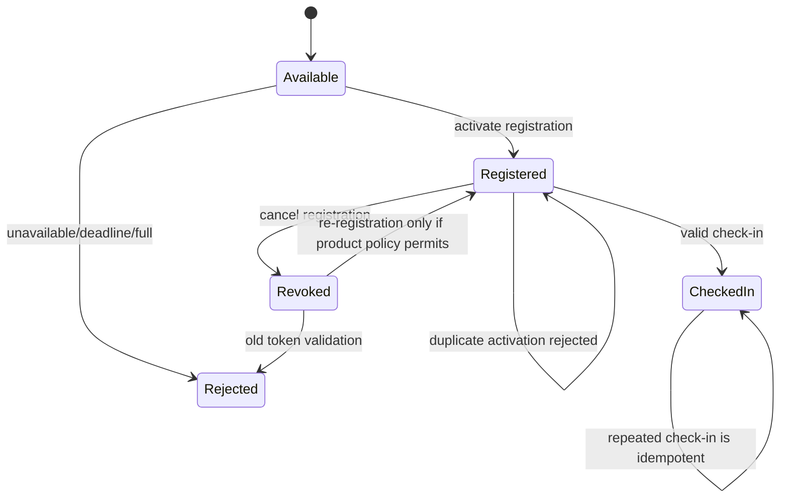

# BDO Events Integration Test Plan

## 1. Purpose

This document is the implementation blueprint and status tracker for the BDO Events integration-test suite. It defines what must be tested across the Flutter application, Supabase database, storage policies, and supported devices while the suite is built and verified.

The initial planning pass is complete. The foundation now contains shared harness support, fixture cleanup, the integration-test SDK dependency, a minimal runner smoke test, a production bootstrap seam, resettable DI lifecycle support, typed event and actor fixtures, bounded concurrency/waits, storage cleanup, and duration reporting. The P0 Supabase data journeys, all five planned P0 UI journeys, and the first nine P1 UI slices are now generated but unverified; remaining P1 and device journeys remain deferred. The purpose remains to agree on scope, ownership, data setup, file boundaries, execution speed, and release gates before expanding the suite.

## Implementation Status

- Completed: extracted the reusable notification `EventStore` fake into `test/shared/fixtures` and removed its duplicate method.
- Completed: updated cross-feature widget tests to use the shared fixture instead of importing another feature's test file.
- Completed: added `TestRunContext` for per-run/per-test data namespaces.
- Completed: added `SupabaseEnvironment` for public app configuration and host-only cleanup credential validation.
- Completed: added a separate app/cleanup `SupabaseClientFactory` with credential-gating contract tests under `shared/harness`.
- Completed: added focused contract tests for both harness helpers.
- Completed: added the Flutter `integration_test` SDK dependency to `pubspec.yaml` and `pubspec.lock`.
- Implemented but unverified: added `features/auth_screen/presentation/pages/integration_runner_smoke_test.dart` under the requested `test/integration_test` location; the smoke test exercises `IntegrationAppHarness` and records its duration through `TestDurationRecorder`.
- Completed: added a typed, namespaced event fixture and contract tests under `shared/fixtures`.
- Completed: added a typed registration/token handle that composes actor and event fixtures under `shared/fixtures`.
- Completed: added an idempotent reverse-order cleanup scope and contract tests under `shared/cleanup`.
- Completed: added typed event and registration cleanup adapters with contract coverage under `shared/cleanup`.
- Completed: hardened `CleanupScope` to retain failed actions for retry after partial teardown, reject actions added during cleanup, and preserve reverse-order cleanup semantics; storage object cleanup is exactly-once when a journey verifies deletion directly.
- Completed: added explicit notification cleanup tracking and contract coverage so notification journeys do not rely only on event cascade behavior.
- Completed: added side-effect-free actor role metadata and namespaced actor factory under `shared/actors`.
- Completed: added injectable actor provisioning and cleanup adapters with contract tests under `shared/actors`.
- Implemented but unverified: added a host-only Supabase actor registrar that creates namespaced confirmed users through the admin endpoint, derives role claims from `TestActorRole`, and keeps its service credential out of app-client code and error messages.
- Implemented but unverified: added the first P0 data journey at `features/event_screen/data/event_rls_integration_test.dart`; it covers authenticated reads, anonymous read/create denial, denied regular-user inserts, and unrelated-user update/delete no-ops with namespaced actors and cleanup.
- Implemented but unverified: added `features/event_screen/data/event_watcher_rls_integration_test.dart`; it covers watcher event reads and verifies watcher update/delete attempts are no-ops.
- Implemented but unverified: added `features/event_detail_screen/data/registration_rpc_integration_test.dart`; it covers active-duplicate rejection, revocation, active-query exclusion, and old-token invalidation for watchers. Re-registration remains an explicit product decision.
- Implemented but unverified: added `features/event_detail_screen/data/capacity_race_integration_test.dart` and a reusable `ConcurrentStartBarrier`; the capacity-one race asserts exactly one active registration and one server capacity rejection.
- Implemented but unverified: added `features/event_detail_screen/data/deadline_integration_test.dart`; it covers future, client-boundary, and past deadlines and proves a stale future client payload cannot bypass the server deadline.
- Implemented but unverified: split watcher coverage into `features/watcher_screen/data/watcher_check_in_integration_test.dart` and `watcher_authorization_integration_test.dart`; the pair covers valid validation, idempotent check-in, stable counts, regular-user denial, malformed/mismatched tokens, and revoked-token behavior.
- Implemented but unverified: added `features/watcher_screen/data/stale_role_integration_test.dart` and a host-only `SupabaseActorRoleUpdater`; the journey proves current-role watcher RPCs reject both stale and refreshed sessions after role revocation.
- Implemented but unverified: added `core/common/event_image/event_image_storage_integration_test.dart` and `core/common/profile_image/profile_image_storage_integration_test.dart`, plus typed `shared/cleanup/storage_cleanup.dart`; the pair covers private/authenticated event-image access, public profile-image reads, owner replacement/deletion, and unauthorized writes.
- Implemented but unverified: added `features/event_screen/data/invitation_rpc_integration_test.dart` and `features/notification_screen/data/notification_rpc_integration_test.dart`; the pair covers admin-only invitation operations, invitee-only acceptance, registration creation, current-user notification reads, unread counts, and mark-read isolation.
- Implemented but unverified: added `features/auth_screen/data/auth_supabase_integration_test.dart`; it verifies requested user/watcher/admin metadata creates pending role requests, does not grant effective privileged claims, and remains unprivileged after session refresh.
- Implemented but unverified: added `features/auth_screen/presentation/pages/authentication_journey_test.dart`; it boots `MyApp` with a real Supabase session, verifies the authenticated shell, drives account-menu logout, and confirms the app returns to sign-in with no active session.
- Implemented but unverified: added `features/event_detail_screen/presentation/pages/registration_journey_test.dart`; it seeds an owner event, registers a real attendee through event detail, opens the ticket, and verifies the registration appears in the calendar.
- Implemented but unverified: added `features/registered_screen/presentation/pages/ticket_cancellation_journey_test.dart`; it pre-creates an active registration, cancels it through the real ticket UI, verifies the calendar returns to its empty state, and confirms the server row is revoked.
- Implemented but unverified: added `features/event_screen/presentation/pages/event_invitation_journey_test.dart`; it sends an invitation from the admin event UI, accepts it from the invitee notification UI, and verifies the accepted invitation and active registration rows.
- Implemented but unverified: added `features/watcher_screen/presentation/pages/watcher_check_in_journey_test.dart`; it uses a manual registration code through the real watcher UI, validates it, confirms all pending scans, and verifies the durable check-in row.
- Implemented but unverified: added `core/deep_link/event_deep_link_journey_test.dart`; it holds a valid custom link while signed out, authenticates through the real sign-in form, opens the event detail destination, and confirms an invalid link is ignored.
- Implemented but unverified: added `features/notification_screen/presentation/pages/notification_arrival_journey_test.dart`; it loads a real notification for an active registration, confirms attendance through the notification UI, and verifies the persisted arrival status.
- Implemented but unverified: added `features/event_screen/presentation/pages/event_analytics_journey_test.dart`; it opens an owned event's attendee list and analytics pages and verifies the registered attendee and check-in metrics.
- Implemented but unverified: added `features/profile_screen/presentation/pages/profile_persistence_journey_test.dart`; it changes dark mode, date format, visibility, phone, and bio settings, verifies the server visibility row, and restores the values across a fresh app composition.
- Implemented but unverified: added `features/event_screen/presentation/pages/event_lifecycle_journey_test.dart`; it edits and revisits a seeded owned event, deletes it through the production drag target, and verifies the server row is removed.
- Implemented but unverified: added `features/event_screen/presentation/pages/event_creation_journey_test.dart`; it selects an in-memory image through the injectable picker, uploads it through real Supabase Storage, creates an event through the production form, and verifies the stored payload and bytes.
- Implemented but unverified: added `features/profile_screen/presentation/pages/profile_image_journey_test.dart`; it selects an in-memory image through the injectable picker, uploads it through real Supabase Storage, saves the public URL in auth metadata, then removes the photo and verifies both metadata clearing and object deletion.
- Implemented but unverified: added `features/auth_screen/presentation/pages/role_navigation_journey_test.dart`; it boots production `MyApp` with real administrator and regular-user sessions and verifies the administrator-only organizer destination.
- Implemented but unverified: added `features/main_screen/presentation/pages/logout_everywhere_journey_test.dart`; it confirms the global sign-out dialog, returns the production app to authentication, and verifies the active app session is cleared.
- Completed: added bounded polling with injectable delay and timeout contract tests under `shared/harness`.
- Completed: added machine-readable async duration recording and contract tests under `shared/harness`.
- Completed: added the test-only `IntegrationAppHarness` with injectable providers and contract tests under `shared/harness`.
- Completed: added a migration manifest and contract tests that fail fast on missing or duplicate migration files.
- Implemented but unverified: added a separate 10-minute GitHub Actions `integration-smoke` job that runs every shared harness, actor, fixture, and cleanup contract under `test/integration_test/shared`, followed by the integration runner smoke test.
- Implemented but unverified: added a separate 25-minute GitHub Actions `integration-p0` job that starts disposable Supabase, resets and lints migrations, verifies the latest migration ledger entry, exports local app/cleanup credentials, runs the explicit P0 data and authenticated UI journeys, uploads failure logs, and always stops Supabase.
- Implemented but unverified: added a separate scheduled/manual `integration-p1.yml` job that starts disposable Supabase, resets and lints migrations, verifies the latest migration ledger entry, exports local app/cleanup credentials, and runs shared harness contracts plus the implemented P1 journeys.
- Completed: restricted the generic CI test job to `test/unit/core`, `test/unit/features`, and `test/shared` so Supabase-dependent integration tests run only in the dedicated integration jobs.
- Completed: added `test/integration_test/.env.example` documenting public app credentials, host-only cleanup credentials, and optional migration diagnostics; it contains no real secrets and is not a Flutter asset.
- Completed: extracted `ApplicationBootstrap` from `main.dart` with injectable startup steps and order-sensitive tests; added `resetDependencies()` and disposal callbacks for singleton Cubits.
- Implemented but unverified: added `shared/harness/authenticated_app_harness.dart`; it starts production `MyApp` with a real Supabase session, a no-op deep-link source, and native services disabled for host-safe UI journeys.
- Implemented but unverified: added scanner, voice, and haptic adapter seams under `lib/features/watcher_screen/presentation/adapters`; host-side watcher tests use `shared/harness/watcher_native_test_adapters.dart` while production defaults retain the native plugins.
- Implemented but unverified: added an injectable event image picker and storage callback boundary to `CreateEventPage`; production defaults retain gallery selection and Supabase storage, and the image-backed creation journey uses the boundary without a native picker.
- Implemented but unverified: added an injectable profile image picker, storage, and deletion boundary to `ProfileDetailsPage` and `ProfileScreen`; production defaults retain gallery selection and Supabase storage, old objects are removed after metadata changes, and pending uploads are cleaned up on failed save or disposal.
- Implemented but unverified: added shared clipboard and sharing adapters for event detail, attendee CSV, and ticket-code actions, with focused dispatch and platform-failure tests; successful copy confirmation is emitted only after the adapter completes.
- Implemented but unverified: added an injectable Nominatim location-search adapter with explicit HTTP-client disposal, plus focused `CreateEventPage` widget coverage for query dispatch and result population.
- Implemented but unverified: added a `LocalNotificationAdapter` boundary for notification initialization, permission, scheduling, reconciliation, and cancellation, with service-level recording-adapter tests and native failure containment; OS delivery remains device-only.
- Implemented but unverified: added a `BiometricAdapter` boundary for availability and authentication, with recording-adapter service tests; OS biometric prompts remain device-only.
- Implemented but unverified: added `test/unit/features/main_screen/presentation/widgets/main_screen_responsive_widget_test.dart`; it covers narrow layouts, large text, high contrast, dark theme, keyboard footer behavior, and account-menu semantics. Physical-device accessibility traversal remains pending.
- Implemented but unverified: added `test/unit/core/security/biometric_lock_gate_widget_test.dart`; it covers startup locking, pause/resume authentication, failed authentication retention, and preference-driven unlock. OS biometric prompts remain device-only.
- Implemented but unverified: the biometric gate now fails closed when its native service is not registered; the widget test covers stale enabled preferences without a service and preserves the lock without throwing.
- Implemented but unverified: added `test/unit/features/watcher_screen/presentation/pages/watcher_scan_screen_widget_test.dart`; it covers scanner callback routing, cooldown protection, torch/camera controls, voice and haptic feedback, native failure containment, and adapter disposal. Camera permissions and real QR frames remain device-only.
- Implemented but unverified: added a bundled-asset guard to event image cleanup so seeded asset-backed lifecycle tests cannot issue invalid Supabase Storage deletes after the event row is removed.
- Implemented but unverified: added `supabase/config.toml` with conventional local API, database, Studio, storage, auth, and mail-catcher settings; mutable test actors and data remain per-run rather than fixed seed identities.
- Deferred: confirming runner discovery for `test/integration_test`; if Flutter does not discover this location, move the complete tree to the conventional root `integration_test/` directory.
- Deferred: executing migrations and P0/P1 journeys in CI, verifying the remote migration version, completing remote cleanup adapters, and expanding UI journeys across the remaining P1 cases until the local/disposable target is proven; no fixed `seed.sql` is committed because test data must remain namespaced and isolated.

## 2. Coverage Language

The repository already contains unit and widget tests under `test/`. This plan adds cross-layer integration coverage.

| Status       | Meaning                                                                       |
| ------------ | ----------------------------------------------------------------------------- |
| Specified    | The behavior has a concrete setup, action, assertion, and cleanup definition. |
| Implemented  | Test code exists.                                                             |
| Passing      | The test ran successfully in the target environment.                          |
| Measured     | A coverage or execution report was generated.                                 |
| Release gate | The test must pass before the related change can be released.                 |

A specified test is not a passing test. A test-plan percentage must never be reported as executable code coverage.

The expanded implementation inventory currently contains 30 slices (`15 P0 +
9 P1 + 6 P2`); 24 are implemented at their planned scope, which is 80% full-
slice status. All six P2 slices have deterministic seams or host tests, but
their device portions remain unverified. The named priority catalog contains
24 IDs (`10 P0 + 8 P1 + 6 P2`) and uses a different denominator. Neither
figure is a runtime pass rate or measured line/branch coverage.

## 3. Audit Summary

### Current strengths

- Unit and widget coverage exists for authentication Cubits, event registration, event state, watcher state, profile state, analytics widgets, tickets, attendees, and shared utilities.
- `SupabaseStore` and `AuthRemoteDataSource` accept injected clients, which gives the data layer a starting point for integration harnesses.
- Supabase migrations contain explicit contracts for roles, event ownership, registration capacity, deadlines, check-in, invitations, notifications, arrival status, and storage.
- The production tree is already organized by feature and layer, so integration scenarios can follow the same ownership model.

### Current gaps and blockers

1. `test/integration_test/` exists, but runner discovery has not been verified because Flutter execution is blocked in the current environment.
2. `pubspec.yaml` and `pubspec.lock` declare `integration_test`; the lockfile change still needs verification with `flutter pub get`.
3. `.github/workflows/dart.yml` has isolated smoke and P0 Supabase jobs, but no device, coverage, duration, or flake-reporting job exists yet.
4. `test/unit/features/notification_screen/presentation/pages/notification_screen_widget_test.dart` previously contained duplicate `loadEventAttendees` methods in `FakeNotificationEventStore`. Phase 0 removed the duplicate and moved the shared fixture to `test/shared/fixtures/fake_notification_event_store.dart`.
5. Some legacy unit/widget tests still contain local fakes or feature-test imports. Integration tests must not depend on presentation test files or their broad `UnimplementedError` fakes; new integration support belongs in `test/integration_test/shared`.
6. `ApplicationBootstrap` now owns the startup order previously embedded in `main.dart`, and `resetDependencies()` disposes singleton Cubits; host-safe authenticated journeys can substitute native services, while device-only adapters remain incomplete.
7. A local `supabase/config.toml` and CI P0 job now define the disposable target and migration checks, but neither has run in the current environment.
8. Adapter seams now exist for image picking/storage, clipboard/sharing, local notifications, biometrics, deep links, geocoding, and watcher scanner/TTS/haptics; OS/device execution remains unverified.
9. The watcher destination remains commented out in `main_screen_destinations.dart`; host UI coverage opens the watcher through the injectable `MyApp` home, while normal role navigation remains a separate product decision.
10. Some privileged SQL functions use current database roles while invitation functions still inspect JWT role claims. Role revocation and stale-token behavior must be tested explicitly.
11. HTTPS deep-link association files are not present in the repository. Hosted Android/iOS association configuration is a separate deployment prerequisite.

## 4. Directory Decision

The user requested `test/integration_test/`, so this plan uses that location:

```text
test/integration_test/
```

Flutter's conventional location is a root-level `integration_test/` directory. The smoke test is implemented in the requested location but must be run once the toolchain is available to confirm discovery. If the runner requires the conventional location, move the complete tree to:

```text
integration_test/
```

The feature and helper structure remains identical either way. No test should be duplicated in both locations.

## 5. Proposed Folder Structure

The structure mirrors `lib` for feature ownership and keeps shared harness code separate from feature scenarios.

```text
test/integration_test/
  INTEGRATION_TEST_PLAN.md

  shared/
    harness/
      integration_app_harness.dart
      authenticated_app_harness.dart
      watcher_native_test_adapters.dart
      app_composition.dart
      supabase_environment.dart
      supabase_client_factory.dart
      migration_manifest.dart
      concurrent_start_barrier.dart
      test_duration.dart
      test_run_context.dart
      bounded_waiter.dart

    actors/
      test_actor.dart
      actor_factory.dart
      actor_cleanup.dart
      supabase_actor_registrar.dart
      supabase_actor_cleanup.dart
      supabase_actor_role_updater.dart

    fixtures/
      event_fixture.dart
      registration_fixture.dart
      invitation_fixture.dart
      notification_fixture.dart
      profile_fixture.dart
      storage_fixture.dart

    cleanup/
      cleanup_scope.dart
      event_cleanup.dart
      registration_cleanup.dart
      invitation_cleanup.dart
      notification_cleanup.dart
      storage_cleanup.dart
      auth_cleanup.dart

    assertions/
      database_assertions.dart
      app_assertions.dart
      storage_assertions.dart

    data/
      test_payloads.dart
      test_ids.dart
      test_dates.dart

  core/
    deep_link/
      event_deep_link_journey_test.dart
    notifications/
      reminder_integration_test.dart
    prefs/
      preference_persistence_integration_test.dart
    security/
      biometric_lock_device_test.dart
    common/
      event_image/
        event_image_storage_integration_test.dart
      profile_image/
        profile_image_storage_integration_test.dart

  features/
    auth_screen/
      data/
        auth_supabase_integration_test.dart
      presentation/
        pages/
          authentication_journey_test.dart
          role_navigation_journey_test.dart

    event_screen/
      data/
        event_rls_integration_test.dart
        event_watcher_rls_integration_test.dart
        event_storage_integration_test.dart
        invitation_rpc_integration_test.dart
      presentation/
        pages/
          event_lifecycle_journey_test.dart
          event_creation_journey_test.dart
          event_invitation_journey_test.dart
          event_analytics_journey_test.dart

    event_detail_screen/
      data/
        registration_rpc_integration_test.dart
        attendee_access_integration_test.dart
      presentation/
        pages/
          registration_journey_test.dart
          attendee_journey_test.dart

    registered_screen/
      presentation/
        pages/
          ticket_cancellation_journey_test.dart

    calendar_screen/
      data/
        registration_calendar_sync_test.dart
      presentation/
        pages/
          calendar_sync_journey_test.dart

    notification_screen/
      data/
        notification_rpc_integration_test.dart
      presentation/
        pages/
          notification_arrival_journey_test.dart

    profile_screen/
      data/
        profile_visibility_integration_test.dart
        profile_storage_integration_test.dart
      presentation/
        pages/
          profile_journey_test.dart
          profile_persistence_journey_test.dart
          profile_image_journey_test.dart

    watcher_screen/
      data/
        watcher_check_in_integration_test.dart
        watcher_authorization_integration_test.dart
      presentation/
        pages/
          watcher_check_in_journey_test.dart
          watcher_device_journey_test.dart

    main_screen/
      presentation/
        pages/
          main_bootstrap_journey_test.dart
          logout_journey_test.dart
          logout_everywhere_journey_test.dart
```

### File ownership rules

- One scenario file owns one journey or one tightly related contract.
- Data/RPC tests verify Supabase contracts directly and do not render the entire application.
- Presentation journey tests drive the application UI and use fixtures only for setup and assertions.
- A test file should target 120 to 180 lines. Review any file above 220 lines.
- A shared helper should target 80 to 140 lines. Split it when it owns more than one responsibility.
- No file should contain all actors, all fixtures, all cleanup, and all assertions.
- No integration test imports a fake from another feature's unit/widget test file.
- No production screen folder receives integration tests. Integration files stay below `test/integration_test/` and mirror the production feature/layer path.

## 6. Test Layers and Responsibilities

| Layer               | Primary question                                      | Examples                                   |
| ------------------- | ----------------------------------------------------- | ------------------------------------------ |
| Unit                | Does one class or function implement its rule?        | DTOs, policies, Cubits, mappers            |
| Widget              | Does one widget render and react correctly?           | Forms, panels, dialogs, loading states     |
| Integration data    | Do app adapters and Supabase contracts work together? | RPC parameters, RLS, storage, persistence  |
| Integration journey | Can a real user complete a cross-feature workflow?    | Register, receive ticket, cancel, refresh  |
| Device/manual       | Does a native capability work on a real platform?     | Camera, biometrics, notifications, sharing |

Do not move pure model, date-format, registration-code, painter, or every form-validation case into integration tests. Those are faster and more precise in the existing unit/widget layers.

## 7. Environment and Harness Design

### Supabase environments

Use a disposable local Supabase project for pull-request and nightly integration tests whenever possible. A shared staging project is acceptable only when data isolation and cleanup are guaranteed.

Required environment values:

- `SUPABASE_URL`
- `SUPABASE_ANON_KEY`
- A host-only service-role credential for trusted cleanup/seeding, never compiled into the Flutter app and never sent to a device
- Optional test project identifier and migration version

The committed `.env.example` is documentation only. CI must inject real values through protected environment/secrets, and the service-role value must remain host-only.

Apply all migrations before the suite. The harness must fail fast when the expected migration version is not available.

### Test run identity

Every test receives a unique namespace:

```text
it-<run-id>-<test-id>
```

Use the namespace in event IDs, user display names, invitation identifiers, storage object paths, and payload metadata. Never use fixed shared IDs such as `event-1` in Supabase integration tests.

Each test owns:

1. Its actors.
2. Its events and registrations.
3. Its invitations and notifications.
4. Its storage objects.
5. Its cleanup scope.

### Actor model

Create fresh clients for each role involved in a test:

- Anonymous client
- Regular user
- Event owner/admin actor where permitted by the migration contract
- Watcher actor
- Unrelated authenticated user
- Trusted host cleanup actor, never exposed to app code

Do not reuse a mutable authenticated client across tests. Do not assign privileged roles through client-controlled metadata. Role setup must use a local seed, trusted host operation, or the configured test-admin mechanism.

### Application harness

The application harness should expose explicit operations such as:

- Start the app with a test composition.
- Register or replace `getIt` dependencies.
- Inject a test `EventStore`, auth adapter, clock, notification adapter, biometric adapter, image adapter, sharing adapter, clipboard adapter, and deep-link source.
- Pump until a stable authenticated or signed-out state.
- Dispose Cubits, subscriptions, clients, and temporary storage.

The harness must not silently swallow setup failures. A failed seed or missing dependency is a failed test setup, not an empty-state assertion.

## 8. Fixture and Cleanup Boundaries

### Fixture modules

- `event_fixture.dart`: creates events, owners, categories, scheduling values, capacity, and metadata.
- `registration_fixture.dart`: activates registrations, retrieves tokens, revokes registrations, and reads active/revoked state.
- `invitation_fixture.dart`: creates invitation recipients, sends invitations, and reads response state.
- `notification_fixture.dart`: creates or retrieves notifications, unread counts, and arrival status.
- `profile_fixture.dart`: updates profile metadata, visibility values, and login activity.
- `storage_fixture.dart`: uploads, reads, replaces, and deletes uniquely named objects.

Fixtures should return small typed handles rather than raw maps throughout the test suite.

### Cleanup rules

- Use `try/finally` for every test that creates remote data.
- Cleanup must be idempotent and safe when setup fails halfway through.
- Delete child records before parent records when the schema requires it.
- Delete storage objects independently of database cleanup.
- Cleanup by run namespace, never by broad table truncation in a shared environment.
- Emit cleanup failures as test failures or explicit teardown failures; never silently ignore them.
- Keep feature cleanup functions feature-owned. A coordinator may call them but should not contain all feature-specific details.

## 9. Priority Test Catalog

### P0 release and data-integrity cases

| ID              | Owner path                  | Setup and action                                                                                              | Assertions                                                                                                                        | Cleanup                       |
| --------------- | --------------------------- | ------------------------------------------------------------------------------------------------------------- | --------------------------------------------------------------------------------------------------------------------------------- | ----------------------------- |
| `P0-AUTH-01`    | `auth_screen/data`          | Create a user requesting regular, watcher, and admin access. Refresh the session.                             | A request is recorded where expected; requested role does not grant effective privileges; trusted role metadata is required.      | Auth users and role requests  |
| `P0-AUTH-02`    | `auth_screen/data`          | Restore a valid session, sign out, sign out everywhere, and attempt protected reads.                          | Authenticated state restores correctly; logout invalidates protected access; no stale user remains in Cubits.                     | Auth user/session             |
| `P0-RLS-01`     | `event_screen/data`         | Admin creates an event. Owner, unrelated user, watcher, and anonymous client attempt reads and mutations.     | Event read/create/update/delete follows the migration matrix; forged creator IDs do not bypass policy.                            | Event graph                   |
| `P0-REG-01`     | `event_detail_screen/data`  | Register a user, retrieve its token, attempt duplicate activation, revoke it, and query active registrations. | One active registration exists; duplicate is rejected; revoked registration is excluded; old token is invalid.                    | Registration, check-in, event |
| `P0-REG-02`     | `event_detail_screen/data`  | Create a capacity-one event and start two activation requests concurrently.                                   | Exactly one activation succeeds; one capacity error is returned; no duplicate active rows exist.                                  | Event and registrations       |
| `P0-REG-03`     | `event_detail_screen/data`  | Attempt activation immediately before, exactly at, and after a server deadline.                               | Only the before-deadline request succeeds; stale client payload cannot bypass the server deadline.                                | Event and registrations       |
| `P0-WATCH-01`   | `watcher_screen/data`       | Validate an active token, check in twice, then test revoked, mismatched, malformed, and cross-event tokens.   | Valid check-in succeeds; second check-in is idempotent; invalid cases are rejected; counts remain stable.                         | Registration and check-ins    |
| `P0-WATCH-02`   | `watcher_screen/data`       | Use regular, watcher, admin, and stale-role clients against validation/check-in/count RPCs.                   | Only permitted current roles can invoke each RPC; role revocation takes effect according to the chosen JWT/current-role contract. | Test actors and data          |
| `P0-STORAGE-01` | `core/common/event_image`   | Owner uploads, reads, replaces, and deletes an event image. Another user and anonymous client attempt access. | Owner-folder policy is enforced; unauthorized write/delete/read is denied; cleanup works after DB success and failure.            | Storage objects and event     |
| `P0-STORAGE-02` | `core/common/profile_image` | Owner uploads and updates a profile image; another user attempts a write.                                     | Public read behavior matches policy; writes and deletes remain owner-scoped.                                                      | Profile image objects         |

### P1 core user journeys

| ID              | Owner path                               | Journey                                                                                                  | Key assertions                                                                                                           |
| --------------- | ---------------------------------------- | -------------------------------------------------------------------------------------------------------- | ------------------------------------------------------------------------------------------------------------------------ |
| `P1-EVENT-01`   | `event_screen/presentation/pages`        | Create, reload, edit, revisit, and delete an event from the UI.                                          | All required and optional fields persist; ownership and creation metadata cannot be overwritten; image cleanup occurs.   |
| `P1-REG-01`     | `event_detail_screen/presentation/pages` | Register from event detail, open calendar, open ticket, cancel, and reload.                              | Registration state propagates across event detail, calendar, ticket, and active-registration queries.                    |
| `P1-INV-01`     | `event_screen/presentation/pages`        | Admin sends invitations to one and many recipients; one accepts and one declines.                        | Recipient list excludes unauthorized users; only acceptance creates an active registration; repeated response is stable. |
| `P1-NOTIFY-01`  | `notification_screen/presentation/pages` | Load, read, confirm attending/not attending, refresh, and inspect unread count.                          | Only the current user's notification changes; arrival state and unread count persist.                                    |
| `P1-ATTEND-01`  | `event_detail_screen/presentation/pages` | Open attendee and analytics views as owner, admin, watcher, and unrelated user.                          | Active attendees and counts are accurate; revoked rows are excluded; restricted profile access is enforced.              |
| `P1-PROFILE-01` | `profile_screen/presentation/pages`      | Update profile metadata, preferences, visibility, and image; start a fresh session.                      | Values persist after restart; visibility remains owner-scoped; login activity is recorded correctly.                     |
| `P1-LINK-01`    | `core/deep_link`                         | Start with a valid custom link while signed out, authenticate, and open the event. Repeat invalid links. | Valid event opens only after authentication; invalid host/path/scheme/unknown event is ignored.                          |
| `P1-LOGOUT-01`  | `main_screen/presentation/pages`         | Use logout and logout-everywhere from the shell.                                                         | All protected Cubits clear state; navigation returns to authentication; no stale ticket/event data remains.              |

### P2 device and native capability cases

| ID             | Owner path                               | Device behavior                                                                                        |
| -------------- | ---------------------------------------- | ------------------------------------------------------------------------------------------------------ |
| `P2-CAMERA-01` | `watcher_screen/presentation/pages`      | Grant/deny camera permission, scan valid/invalid QR, use manual code, toggle torch, and switch camera. |
| `P2-AUDIO-01`  | `watcher_screen/presentation/pages`      | Verify TTS language/volume/mute, vibration, and recovery after native failure.                         |
| `P2-NOTIFY-01` | `core/notifications`                     | Request notification permission, schedule, reconcile, cancel, and verify restart behavior.             |
| `P2-BIO-01`    | `core/security`                          | Enable lock, pause/resume app, authenticate successfully, reject authentication, and disable lock.     |
| `P2-SHARE-01`  | `event_detail_screen/presentation/pages` | Copy and share ticket/event/attendee data on supported platforms.                                      |
| `P2-RESP-01`   | `main_screen/presentation/pages`         | Verify dark mode, large text, high contrast, narrow layout, keyboard, and accessibility traversal.     |

The deterministic host portion of `P2-RESP-01` is implemented in
`test/unit/features/main_screen/presentation/widgets/main_screen_responsive_widget_test.dart`.
Physical-device execution for every P2 case remains unverified.

## 10. Test Design Techniques

### Registration decision table

| Availability | Deadline | Existing registration | Capacity  | Expected result            |
| ------------ | -------- | --------------------- | --------- | -------------------------- |
| Closed       | Any      | Any                   | Any       | Reject as unavailable      |
| Open         | Passed   | Any                   | Any       | Reject as deadline passed  |
| Open         | Future   | Yes                   | Any       | Reject as duplicate        |
| Open         | Future   | No                    | Full      | Reject as capacity reached |
| Open         | Future   | No                    | Available | Activate exactly once      |

### Capacity boundary analysis

Use server time and synchronized requests:

- Capacity `0`, if the schema allows it: reject or document the invariant.
- Capacity `1`: one success and one concurrent rejection.
- Capacity `N - 1`: one successful registration reaches capacity.
- Capacity `N`: reject.
- Capacity `N + 1`: server must reject or preserve the invariant.
- Repeat the same request after success and after cancellation.

### Role equivalence partitions

- Anonymous user
- Authenticated regular user
- Authenticated watcher
- Authenticated administrator
- Authenticated owner of the resource
- Authenticated unrelated user
- Authenticated user with a stale or revoked role claim

Each P0 authorization contract must include at least one representative from every relevant partition.

### Registration state transitions



The product decision for re-registration after cancellation must be recorded before implementing `P0-REG-01`.

## 11. Speed Strategy

### Execution tiers

| Tier                | Runs                                                                                         | Target                                               |
| ------------------- | -------------------------------------------------------------------------------------------- | ---------------------------------------------------- |
| PR smoke            | Harness boot, auth, one event RLS case, one registration case, one watcher manual-entry case | Fast feedback, approximately 3 to 5 minutes          |
| PR P0               | All P0 data/RLS/storage cases plus auth, registration/ticket, and watcher UI journeys        | Release-risk feedback, approximately 8 to 15 minutes |
| Scheduled P1        | Implemented P1 journeys against disposable Supabase                                          | Broad product confidence                             |
| Scheduled device P2 | Camera, notification, biometric, sharing, image picker, TTS, and responsive device matrix    | Native capability confidence                         |

### Runtime optimization rules

- Do not launch the full application for direct RLS/RPC tests.
- Reuse immutable environment setup, schema verification, and connection metadata; create fresh actors and mutable data per test.
- Use `setUpAll` only for read-only environment setup. Use `setUp` for actor/data isolation.
- Use explicit bounded polling for backend/UI propagation. Do not use arbitrary `Future.delayed` sleeps.
- Suggested budgets: 5 to 10 seconds per network operation, 3 to 5 seconds for a UI transition, and no more than two retries for known transient session propagation.
- Never retry an assertion failure, authorization failure, deterministic RPC error, or RLS failure.
- Use a synchronization barrier for capacity races so the server transaction is tested rather than Dart scheduling.
- Keep test data small. Use one or two records for policy tests and only use larger volumes for explicit pagination/performance cases.
- Run independent P0 files in parallel only when each test has an isolated namespace and the local Supabase instance has enough resources.
- Capture duration per test file and fail the performance budget when a test becomes consistently slow.
- Keep device tests separate from PR data tests. Native plugin startup should never slow the core PR gate.

## 12. Required Seams Before UI Integration Code

The following interfaces should be introduced before writing broad journey tests:

- App composition/bootstrap seam for `main()` and resettable `getIt` registrations.
- Injectable clock for UI deadline validation and server-time test coordination.
- Implemented but unverified: auth client/session source through the authenticated app harness.
- `EventStore` adapter boundary for Supabase RPC/table calls.
- Implemented but unverified: image picker and event/profile storage adapters.
- Implemented but unverified: notification permission/scheduling adapter.
- Implemented but unverified: biometric adapter.
- Implemented but unverified: camera/scanner adapter.
- Implemented but unverified: TTS and haptic adapters.
- Implemented but unverified: clipboard and sharing adapters.
- Implemented but unverified: local notification adapter.
- Deep-link source adapter.
- Implemented but unverified: geocoding/location search adapter.

Each seam must have a small contract test or unit test before it is used by a large journey.

## 13. Implementation Sequence

### Phase 0: Agree and unblock

1. Confirm whether the runner supports `test/integration_test/`; otherwise use root `integration_test/`.
2. Add the `integration_test` SDK dependency in `dev_dependencies`.
3. Repair the duplicate method in the shared notification fixture.
4. Stop integration tests from importing feature widget-test fixtures.
5. Decide the re-registration-after-cancellation product rule.
6. Establish local Supabase configuration, migration application, seed data, and trusted cleanup.

### Phase 1: Minimal harness

1. Implemented: environment verifier.
2. Implemented: run namespace and side-effect-free actor metadata factory.
3. Implemented: typed event fixture and cleanup scope.
4. Implemented but unverified: runner smoke test in the requested location and authenticated app boot through `AuthenticatedAppHarness`.
5. Implemented: machine-readable duration recorder for future smoke and journey tests.
6. Implemented but incomplete: production startup order is injectable through `ApplicationBootstrap`, resettable DI lifecycle support is available, and host-safe authenticated app composition is reusable; broader native-service adapters remain before device journeys.
7. Implemented but unverified: local Supabase configuration and CI P0 backend bootstrap; fixed seed identities are intentionally deferred in favor of namespaced per-test provisioning.

### Phase 2: P0 data contracts

Implement in this order:

1. Implemented but unverified: auth role-request integrity; session restore/logout remains a separate UI contract, while stale-role revocation is covered by `stale_role_integration_test.dart`.
2. Implemented but unverified: event RLS matrix for authenticated reads, anonymous read/create denial, admin-owned creation, regular-user insert denial, unrelated-user update/delete no-op behavior, and watcher update/delete no-op behavior.
3. Implemented but unverified: registration lifecycle and token invalidation, including duplicate active registration rejection, revoked-row exclusion, and old-token invalidation. Re-registration remains deferred until its product rule is recorded.
4. Implemented but unverified: capacity-one race with synchronized activation requests and deadline enforcement with a stale-payload attempt.
5. Implemented but unverified: watcher authorization and idempotent check-in, split into focused validation/check-in, invalid-token authorization, and stale-role journeys.
6. Implemented but unverified: event/profile storage policies, with separate journeys for private event images and public-read profile images.
7. Implemented but unverified: invitation and notification authorization, split into invitation and notification RPC journeys.

### Phase 3: P0 UI journeys

1. Implemented but unverified: authentication/session/logout.
2. Implemented but unverified: event registration to calendar to ticket.
3. Implemented but unverified: ticket cancellation and refresh.
4. Implemented but unverified: manual watcher entry and bulk check-in.
5. Implemented but unverified: admin invitation and recipient response.

### Phase 4: P1 journeys

1. Implemented but unverified: deep-link navigation from a signed-out pending link through authentication to event detail, including invalid-link rejection.
2. Implemented but unverified: notification arrival and persisted attendance confirmation.
3. Implemented but unverified: owner attendee list and analytics navigation.
4. Implemented but unverified: profile preference, visibility, and editable metadata persistence.
5. Implemented but unverified: seeded event edit, revisit, and delete lifecycle.
6. Implemented but unverified: image-backed event creation and storage verification.
7. Implemented but unverified: profile image upload and metadata persistence.
8. Implemented but unverified: administrator versus regular-user role navigation.
9. Watcher role navigation remains deferred while its production destination is disabled.

### Phase 5: P2 native tests

The deterministic host portions of responsive, biometric-gate, and watcher
adapter behavior are implemented but unverified. Add device-only coverage
after platform seams and test devices are available. Keep native tests
isolated from data-contract CI.

### Phase 6: CI and reporting

Add separate jobs for:

- Unit/widget checks
- P0 integration checks against disposable Supabase
- Implemented but unverified: scheduled/manual P1 integration checks against disposable Supabase
- Scheduled Android/iOS device checks
- Coverage report generation
- Test duration and flake reporting

## 14. Release Gates

A change affecting a P0 path cannot merge when:

- Any P0 integration test fails.
- Cleanup leaves test data or storage objects behind.
- A role or RLS assertion is skipped or quarantined.
- A concurrency test is replaced with a sequential approximation.
- A test uses a production credential or embeds a service-role secret.
- A test relies on an unbounded wait or arbitrary sleep.
- The integration harness cannot verify migration version.

The suite is considered operationally ready only when:

- P0 tests pass repeatedly in a disposable environment.
- P1 tests pass on the nightly schedule.
- Device tests have recorded results for supported Android/iOS versions.
- CI publishes test results and measured coverage.
- Test duration and flake rate are visible.
- Failed teardown is actionable and does not silently accumulate remote data.

## 15. Next Implementation Slice

The next code slice should verify the reproducible backend target and current authenticated app composition before the P1 suite is treated as passing:

1. Run the smoke and P0 CI jobs, then resolve any runner, migration, schema, or authenticated-app failures.
2. Confirm the dependency lockfile with `flutter pub get` and verify the local migration ledger.
3. Treat the nine implemented P1 journeys as unverified until the scheduled workflow runs; then add only the remaining product-specific or device-dependent coverage.

Do not generate all P0/P1 test files at once. Validate the environment and cleanup behavior before expanding the suite.
